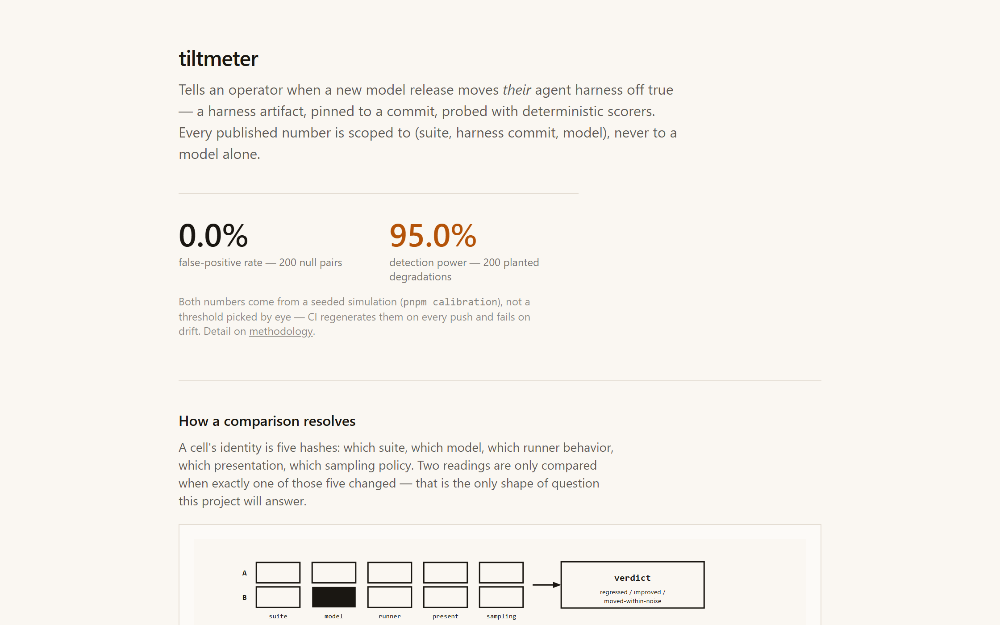
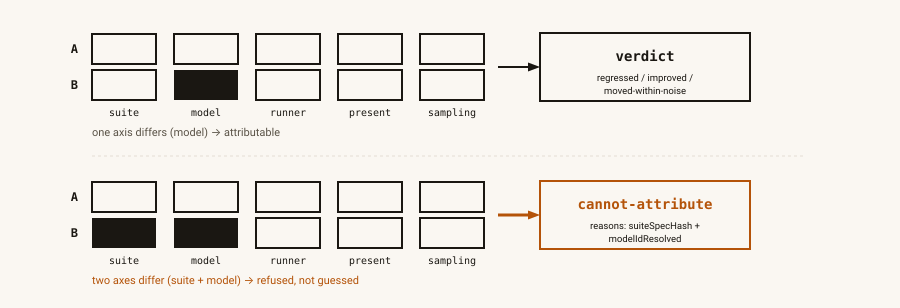

<p align="left">
  
</p>

# tiltmeter

**tiltmeter tells an operator when a new model release moves *their* agent
harness off true — not how capable a model is in the abstract, but whether a
specific skill description, tool schema, routing prompt, or output contract
still fires the way it did last week.** The unit of measurement is a harness
artifact, pinned to a commit and probed with deterministic scorers; every
published number is scoped to `(suite, harness commit, model)`, never to a
model alone.

> **Status: pre-release (M0–M8 landed; v1 implementation complete, unpublished).**
> The API in [docs/SPEC.md](docs/SPEC.md) is designed and frozen for v1; every
> milestone through M8 is real and tested. The runner, the attribution model,
> the calibrated classifier, the real Anthropic client (batch + sync + cost
> planning + caps), the observatory's own data (4 pre-registered launch
> suites, 108 items, the panel, the pricing manifest, cited model release
> dates), the static site (`apps/web` — 6 routes, `output: "export"`, 21
> Playwright e2e tests against the real build), the three scheduled
> workflows (`reading.yml`/`release-watch.yml`/`health.yml`), and
> `tiltmeter init` (scaffolds a suite from real artifacts — this package
> works on a harness that isn't James's) are all real and tested. **No real
> reading has ever been taken and no API key has ever been used** — the
> first run group spends James's money and is a deliberate, James-gated step
> (see `observatory/readings/README.md`); `/` and `/readings/<rg>` render
> the honest launch state accordingly. The version below is a release
> candidate, not a released version. Nothing in this README claims to work
> until its milestone's tests say so.

## Calibration

<!-- calibration:begin -->
**Calibration (SPEC §12)** — seeded simulation, `B = 10,000` bootstrap resamples per trial, `40`-item pool, `200` trials per gate:

| gate | bar | achieved |
|---|---|---|
| false-positive rate — 200 null pairs, identical per-item rates | ≤ 5% (CI gate: ≤ 8/200) | **0.0%** (0/200) |
| detection power — 200 pairs, planted 20% degradation (8 of 40 items) | ≥ 90% | **95.0%** (190/200) |

Regenerate with `pnpm calibration` — deterministic, seeded, $0. Full detail in [evals/calibration/RESULTS.md](evals/calibration/RESULTS.md).
<!-- calibration:end -->

These are the two numbers a calibrated classifier lives or dies on: how
often it fires when nothing changed, and how often it catches a real,
planted regression. Both come from a pure, seeded simulation — no model
call, no live data — and CI regenerates them on every push and fails on any
drift from what is committed here.

## See it run

[](https://tiltmeter.vercel.app)

A scripted Playwright run against the real deployed site (`scripts/record-demo.mjs`), not a screen capture:
the landing page, then `/models` (proving no leaderboard exists there), then `/methodology`. Click the frame
above to watch it autoplay, muted and looped, on [tiltmeter.vercel.app](https://tiltmeter.vercel.app) — or
open the file directly at `apps/web/public/demo/tiltmeter-demo.webm`.

## How a comparison resolves



Five hashes identify a reading: which suite, which model, which runner behavior, which presentation
template, which sampling policy. Two readings are compared only when exactly one of those five differs.
Two differing — most often a suite edit landing in the same window as a model release — refuses to resolve:
`cannot-attribute`, published with the exact axes that co-varied, never guessed. Generated by
`scripts/diagram.mjs` (deterministic, CI-drift-checked); regenerate with `pnpm diagram`.

## Install

```
npx tiltmeter@1 <command>
```

No global install, nothing to configure first. `init`, `lint`, `plan --offline`, and `verify` all work with
**no `ANTHROPIC_API_KEY` and no network** — proven against the packed npm tarball installed fresh into an
empty directory, not just inside this monorepo (`scripts/pack-check.mjs`, SPEC §14 M8).

## Five-minute quickstart (no API key)

```
npx tiltmeter@1 init --from-skills <dir>
npx tiltmeter@1 lint
npx tiltmeter@1 plan --run-group <id> --offline
```

`init` scaffolds a suite from a real directory of `<skill-name>/SKILL.md` files. `lint` checks it — schema,
the negatives quota, item provenance, token headroom. `plan --offline` builds the run matrix and an
approximate cost estimate. Nothing in this trio spends money; only `tiltmeter run` does, and it is a
separate, explicit command, never something `plan` or `lint` does on your behalf. Full walkthrough, including
what each command's output means, at [tiltmeter.vercel.app/docs](https://tiltmeter.vercel.app/docs).

## Pre-registration, proved in 30 seconds

```
npx tiltmeter@1 verify
```

For each reading it recomputes `suiteSpecHash` from the suite file, walks git history for the first commit
whose tree contains that hash, reads the model's cited release date from `models.json`, and asserts the
suite was registered before the model was released — printing the commit SHA and both dates. Git history on
a public repo is the actual proof; the command just turns checking it into a 30-second job instead of an
afternoon of `git log`.

## Why

Every agent harness is full of small, load-bearing artifacts: the sentence
that decides whether a skill fires, the tool schema an agent chooses between,
the prompt that steers a routing decision, the shape a downstream consumer
requires back. A model release can move any of these without moving any
capability benchmark at all — and "capability benchmark" is not what a
harness operator actually needs to know. tiltmeter probes your *own*
artifacts, deterministically, and tells you when they moved:

- **A pre-registered suite** — your artifacts, vendored and hashed
  (`suiteSpecHash`), so a suite edit is never invisible and never quietly
  changes what "regressed" means.
- **The attribution model** — a comparison is computed only when exactly one
  axis (model, time, or your own harness edit) varies between two readings.
  Everything else is `cannot-attribute`, published with `reasons[]`, never
  guessed.
- **A calibrated classifier, not a vibe** — a seeded paired bootstrap over
  items, with a measured false-positive rate and detection power, not a
  threshold picked by eye.
- **Zero LLM judges, anywhere.** If a probe cannot be scored deterministically,
  the probe is wrong — the probe gets fixed, not the judge added.

## Non-goals (hard guards — refusals, not backlog)

1. **No capability benchmarking.** No metric about a model in isolation,
   ever. No page ranks models. This is the project's death condition —
   enforced structurally, not by convention.
2. **No LLM judge anywhere** — not in the gate, not as a diagnostic tier.
3. **No visitor-triggered compute.** No API routes, no database, no key
   input field, no hosted run path.
4. **Not an agent-runtime driver.** tiltmeter presents your artifacts through
   a declared presentation over the Messages API; it does not drive Claude
   Code, your CLI, or your production loop.
5. **No cross-vendor panel at v1.** Anthropic first-party only.

See [docs/SPEC.md](docs/SPEC.md) §1 for the full guard list and §13 for the
acceptance criteria that keep them true.

**This is a FLAGSHIP in the Agent James portfolio — deep, evaluated,
versioned, and supported — not a sharp tool with one job.** The portfolio's
other releases ([snapgauge](https://github.com/jamessuuu/snapgauge),
[chaff](https://github.com/jamessuuu/chaff)) are deliberately the opposite:
one deterministic job each, no roadmap of adjacent features, an honest
README about scope. tiltmeter earns the deeper tier because the claim it
makes — a calibrated, attributable measurement of whether a model release
moved a specific harness — needs the attribution model (§4), the seeded
bootstrap (§5), and the scheduled observatory (§8) to be true at all; a
sharp tool's one-job simplicity would just be a worse version of a
capability leaderboard, which is exactly what this project refuses to be
(see Non-goals above).

## Package

| Package | Purpose |
|---|---|
| `tiltmeter` | The only published package — core (suite/presentation/scorers/reading/compare/stats), the Anthropic client, and the CLI. `"."` is the isomorphic programmatic API; `"./testing"` is `FakeModelClient` + fixture builders, which is what makes the eval suite cost $0. |

`observatory/` (James's own instance — suites, presentations, readings) is
data and config only, zero code, so a fork replaces it and keeps everything
else (docs/SPEC.md §2). `apps/web` is the static site (Next.js 16.3.0 App
Router, `output: "export"`) — built and tested (`pnpm e2e` from root, 21
Playwright tests against the real static export), deployed at
[tiltmeter.vercel.app](https://tiltmeter.vercel.app).

## CLI

```
npx tiltmeter@1 init --from-skills <dir> | --from-mcp <tools.json> | --from-snapgauge <snapshot.json>
npx tiltmeter@1 lint [suiteId]
npx tiltmeter@1 plan --run-group <id> [--offline]
npx tiltmeter@1 run --plan <id> [--resume]
npx tiltmeter@1 verify
```

| Command | Spends? | Does |
|---|---|---|
| `init` | no | Scaffolds a suite from **your own** real artifacts — a directory of `SKILL.md` files, an MCP `tools/list` dump, or a [snapgauge](https://github.com/jamessuuu/snapgauge) snapshot (its `tools[]` already carries real tool schemas — free interop). This is what makes tiltmeter a tool other people can point at their harness, not just James's private observatory. Every scaffolded item's scenario is an explicit `TODO` — never a fabricated "good" eval prompt (no LLM anywhere in this project, so there is no honest way to synthesize one) |
| `lint` | no | Schema, the negatives quota, item immutability vs git, provenance level, `maxTokens` headroom |
| `plan` | no | Builds the run matrix and an exact cost estimate via `count_tokens` (free); `--offline` falls back to a heuristic and marks the estimate approximate |
| `run` | **yes** | Executes a pinned plan — batch or sync, `--resume` never double-spends |
| `verify` | no | Body hashes, index chain, artifact provenance, the pre-registration proof |

`ANTHROPIC_API_KEY` from env only — never a flag, never written to disk,
never sent anywhere but `api.anthropic.com` (SECURITY.md). `init`, `lint`,
`plan --offline`, and `verify` all work with **no key and no network** —
proven for real against the packed npm tarball in a clean scratch
directory, not just in-repo (`scripts/pack-check.mjs`, SPEC §14 M8).

`compare` (the axis-check → verdict logic SPEC §7 also names as a CLI
command) and `report` are real, tested, and exported from the package's
programmatic API (`compareReadings` et al.) but are **not yet wired as
`tiltmeter` subcommands** — every comparison this repo publishes today is
computed by `apps/web` calling that same function at build time, not by a
CLI invocation. Honest gap, not a hidden one.

## The site (`apps/web`)

| Route | Renders |
|---|---|
| `/` | The instrument — the calibration numbers, the attribution diagram, the demo recording, the pre-registration argument, per-suite series with hard breaks at every `suiteSpecHash` change, the null-pair noise band, and (today, honestly) SPEC §11's launch-state copy since there is no time series yet |
| `/readings/<runGroupId>` | Every cell, completeness, actual USD cost, per-item table, the pre-registration triple. Zero real pages today (`observatory/readings/` is empty) — one honest placeholder page explains why |
| `/suites/<id>` | Items (incl. retired), artifact provenance, current `suiteSpecHash` — 4 real static pages, one per launch suite |
| `/models` | Panel + model metadata. **No ranking, no scores, no leaderboard** — the death-condition guard, asserted structurally by `e2e/models.spec.ts` |
| `/methodology` | Presentation templates, all 8 scorers, k/temperature and why not 0, the axis rules, the bootstrap, the noise floor, cost policy, Limitations |
| `/docs` | Install, the no-key quickstart, the attribution model (with the diagram), the statistics, item immutability, the cost model, the secret boundary, failure modes, limitations — written for a reader who has never seen this project |

Every route is prerendered (`output: "export"` + `export const dynamic =
"error"` on each one — SPEC §7). Chip-mark favicon, OG metadata, and a
footer (chip mark + "Built by James Lorenz Santos" + agentjames.vercel.app
+ this repo — no hire-me CTA, BRAND-KIT.md D1) on every page, generated by
`scripts/brand.mjs` (`pnpm brand`, deterministic, CI-drift-checked).

## Launch suites (SPEC §11)

Four suites, pre-registered from real artifacts on this machine, **108
active items, 31.5% negative** — `tiltmeter lint` and the regression tests in
`packages/tiltmeter/src/observatory.test.ts` keep this table honest:

| Suite | Real artifacts | Items | Probe |
|---|---|---|---|
| `house-skill-activation` | 10 real `SKILL.md` descriptions from `~/.claude/skills` | 20 pos + 12 neg = 32 | `activation` |
| `mcp-tool-selection` | Real, public tool schemas from context7, github-mcp-server, playwright-mcp (repo+commit+blobSha attributed) | 20 pos + 8 neg = 28 | `tool-selection` |
| `routing-adherence` | The worlds router + routing-discipline blocks from `~/.claude/CLAUDE.md`/`ECOSYSTEM.md` | 16 pos + 6 neg = 22 | `instruction-adherence` |
| `output-contract` | The ecosystem's own artifact vocabulary (Brief/Verdict/Handoff) + a `decline(reason_code)` channel | 18 pos + 8 neg = 26 | `output-format`, `refusal-shape` |

**There is no time series yet — that is what pre-registration means. The
series starts here.** Nothing from any private employer or client world
appears in any suite (verified: `mcp-tool-selection`'s artifacts are 100%
public; every other suite draws only from this machine's own `~/.claude`,
with world names and filesystem roots generalized to neutral placeholders
before commit — see `routing-adherence`'s `docs` field).

## Failure modes (SPEC §9 — the ugly paths, by contract)

| Situation | Contract |
|---|---|
| 429 / 529 / transient 5xx | Full-jitter backoff, ≤3 attempts, `Retry-After` honoured; then the trial is `noResult` — never scored as a fail |
| Truncated response (`max_tokens`) | `noResult` with reason; `lint` requires `maxTokens ≥ 4×` the largest expected output so this stays rare |
| Any `noResult > 0` | Reading `status: "partial"`; the denominator is always `items × k` — missing trials are never dropped — and excluded from every aggregate comparison (`cannot-attribute(incomplete)`). Per-item detail is still published |
| Crash / cancelled workflow after batch submit | A deterministic `custom_id` is persisted to `run.json` as `status: "pending"` **before** the batch is ever submitted; a cell with a recorded `batchId` refuses a new submission. A cell left `pending` with no `batchId` by an interrupted prior process is genuinely ambiguous (no provider-side idempotency key exists to check) — `--resume` refuses to guess rather than risk a duplicate charge (`E_AMBIGUOUS_PENDING_BATCH`) |
| Batch expires (24h) / partially fails | Expired requests → `noResult`; one retry of only the failed subset within the same run group |
| Cap tripped mid-run | Stop submitting, write `aborted`, commit, banner on the site. **Never silent** — see `docs/OPERATIONS.md` §4 for exactly what this looks like |
| Model id 404 / retired | Cell `unavailable`, run continues, every comparison touching it → `cannot-attribute` |
| Alias resolved to a different snapshot | Published as a `provider-substitution` event; comparisons across it → `cannot-attribute` |
| API key missing/invalid | Exits **before** spending, writes a `skipped` record with reason, commits (SPEC §8's 60-day mitigation) |
| Suite edited between plan and run | `plan.json` pins `suiteSpecHash`; a mismatch refuses with its own exit code (`E_PLAN_STALE`, distinct from a generic usage error), "re-plan" |
| Fork PR / external contributor | `reading.yml`/`release-watch.yml` are `schedule`/`workflow_dispatch` only, mechanically checked by `ci.yml`'s `lint-workflows` stage — no workflow reachable by external input ever sees `ANTHROPIC_API_KEY` (SECURITY.md) |
| Hobby blackout / every function paused | The site is 100% static; nothing to pause. `/` still renders |
| Site build grows unbounded | Last 52 run groups prerendered in full; older ones link to raw JSON on GitHub |

## Build order

`docs/SPEC.md` §14 is the source of truth; this table tracks status only.

| M | Deliverable | Status |
|---|---|---|
| M0 | Workspace, TS strict, ESLint 9, Vitest 4, 5-stage CI, LICENSE, SECURITY.md | done |
| M1 | Walking skeleton: suite schema, `skill-tool@1` presentation, 3 scorers, `FakeModelClient`, `run`, `compare` (mean delta) | done |
| M2 | Attribution: axis tuple, run groups, `cannot-attribute`, rebaseline, hash-chained index, `verify` | done |
| M3 | Statistics: seeded paired bootstrap, MDE, per-metric verdicts, calibration sims | done |
| M4 | Real client: Messages + Batch + `count_tokens`, pricing manifest, caps, `custom_id`/`--resume`, `tiltmeter plan`/`run` | done |
| M5 | Observatory: 4 launch suites (108 items, real artifacts, cited provenance), `panel.json`, `models.json`, `tiltmeter lint`, the real `tiltmeter verify` git pre-registration walk | done |
| M6 | The site: 6 routes, static export, dead-man banner, brand + OG, 21 Playwright e2e tests | done |
| M7 | Workflows: `reading.yml` (weekly + skipped-record commits), `release-watch.yml` (PR-gated model additions), `health.yml`, `docs/OPERATIONS.md`, the workflow-secret-boundary lint stage | done — none ever executed |
| M8 | `tiltmeter init` (scaffolding), the tarball smoke test, `release.yml`, version → `1.0.0-rc.1` | done — never published or tagged |
| — | Design pass: the attribution diagram, the demo recording, the evidence-dense landing page, `/docs` | done |

## Limitations (SPEC §13)

- **Presentation ≠ your runtime.** tiltmeter presents your artifacts through
  a declared `presentation` template over the Messages API — it does not
  drive Claude Code, your CLI, or your production agent loop. A skill
  description rendered as a `Skill` tool enum entry is a faithful
  *approximation* of how your real harness routes, not a replay of it.
- **No seed exists on the API.** There is no way to make a model call
  deterministic; `k` repeats and the null pair are how this project copes
  with that, not a workaround that eliminates it.
- **`k=3` is suite-level-inferential only.** The seeded paired bootstrap
  gives a calibrated verdict at the *suite* level; no individual item's
  held/broke/fixed/flaky label carries a confidence interval at that
  sample size.
- **Aliases can be substituted.** A panel entry pinned to an alias (not a
  dated snapshot) can silently resolve to a different build between run
  groups — published as `provider-substitution`, never averaged through.
- **Anthropic-only panel.** No cross-vendor comparison at v1 — see
  Non-goals above.
- **Batch results may lag a release by up to 24 hours.** The Message
  Batches API's own SLA, not something this project controls.
- **The suites are James's harness.** The four launch suites measure
  *his* `~/.claude` skills, tool schemas, and routing prompts — they are
  not a claim about anyone else's harness, and not a capability claim
  about any model (see Non-goals). `tiltmeter init` exists precisely so
  someone else's harness gets someone else's suites.

## Non-goals for this package specifically

No domain logic beyond the harness-drift measurement itself. No hosted run
path, ever (see Non-goals above). No telemetry.

---

Part of the [Agent James](https://agentjames.vercel.app) portfolio.
Built by James Lorenz Santos. Code MIT; brand assets excluded (see LICENSE).
